# Quick Guide — MaxRecovery Timer for Apple Watch & iPhone

**Last updated / 最終更新:** 2026-09-27

> 🌐 言語 / Language: **English** / [🇯🇵 日本語](guide-ja.html)

> 🐛 Report bugs & suggestions: **[Feedback form](feedback.html)**

---

### 1. About

Record **hot phase → rest** and your heart rate on Apple Watch, then review
your heart rate recovery (HRR) on iPhone.

- Sessions are recorded on **Apple Watch** (the iPhone can't record one on
  its own).
- The **Afterglow Score (0–100)** is a reference value based on how far your
  heart rate drops after the hot phase. It is not a medical metric.

### 2. Setup

- Install [MaxRecovery Timer](https://apps.apple.com/us/app/maxrecovery-timer/id6815294404)
  from the App Store. The Watch app installs automatically (if not, install
  it from the Watch app on your iPhone).
- On first launch, allow **Health** and **Location** (optional). On the
  Watch, tap **I Understand**.
- If your iPhone is signed in to iCloud, your history is backed up
  automatically (no setting needed).
- Choose your hot environment in the iPhone **Settings tab → Hot phase →
  Hot phase environment** (Warming Room, Hot Spring, Hot Bath, Hot Yoga,
  Infrared Sauna, Steam Bath, Sauna, Other; default: Warming Room).

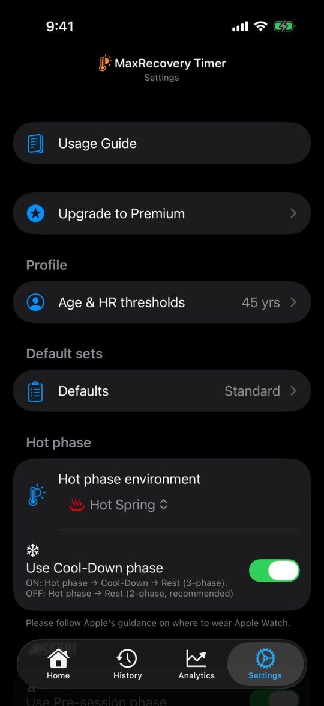

### 3. Start a session

Open MaxRecovery on your Apple Watch and tap **Start Standard** or
**Start Simple**.

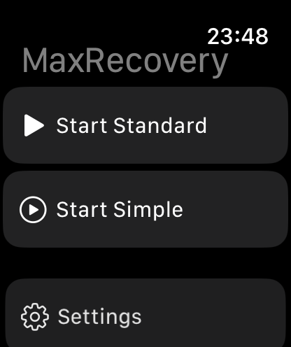

- **Standard** — each set is Hot phase → Rest. Add more in the iPhone
  Settings tab:
  - Cool-Down: Hot phase → "Use Cool-Down phase" (Hot → Cool-Down → Rest)
  - Pre-session: Session → "Use Pre-session phase" (once at the start; no
    heart rate)
  - Extra: Session → "Use extra phase" (after Rest in each set)
- **Simple** — no phases. Double Tap starts the next set.

### 4. During the session

| Action | What it does |
|---|---|
| Double Tap | Next phase (next set in Simple mode) |
| Digital Crown up | Pause / resume |
| Digital Crown down | End confirmation; turn down again to end |

- Double Tap: tap the thumb and index finger of the hand wearing the Watch
  together twice (Series 9 / Ultra 2 or newer, or another supported model).
- While paused, Double Tap does nothing.
- Phases never switch on their own. During the hot phase, the Watch
  vibrates when your heart rate reaches TH1 and TH2.

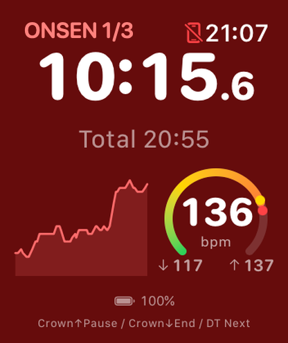 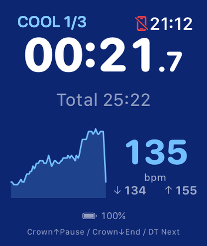 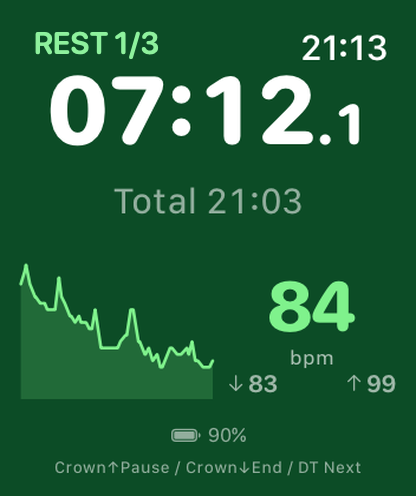

Hot phase, Cool-Down, Rest. The yellow and red dots on the gauge are TH1 and TH2

### 5. End the session

- Turn the **Digital Crown down twice** to end.
- In Standard mode, Double Tap during the final set's rest opens "What's
  next?". **Tap** End or +1 set.
- Then pick 1–5 stars with the Crown and Double Tap to confirm, or tap
  Skip. **The session is saved and sent to your iPhone only at this point.**
- After 60 minutes without input the session ends automatically. The rating
  screen still waits, so open MaxRecovery and confirm or skip.

### 6. Review on iPhone

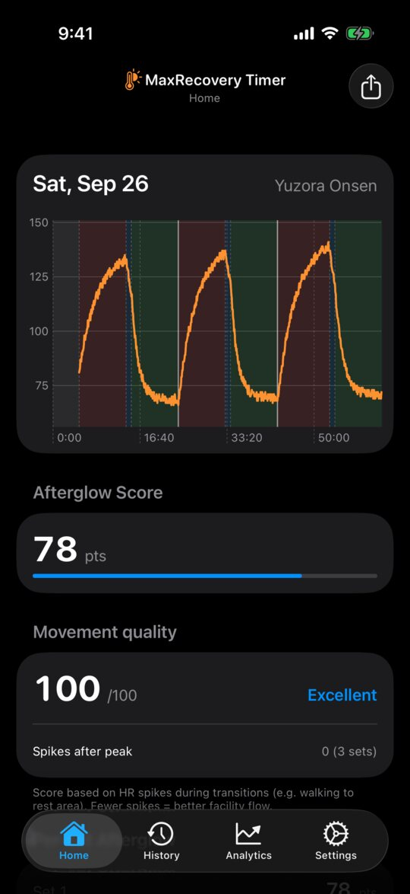 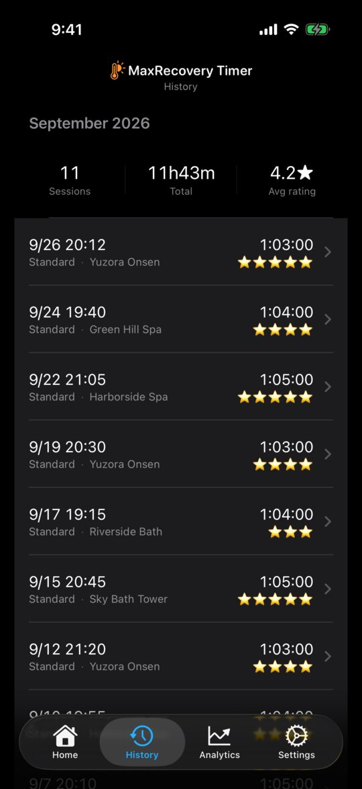

- **History** — tap a session for its heart-rate chart, Afterglow Score and
  per-set breakdown. Edit the venue and rating there.
- **Analytics** — trends, calendar, streak, Top sessions, and the Venue map
  (sessions with a location only).
- **PDF report** (Premium) — Analytics tab → Generate PDF report → pick a
  period → Generate and share. Three A4 pages.
- **CSV** (Premium) — Settings tab → Data → Data export / import.

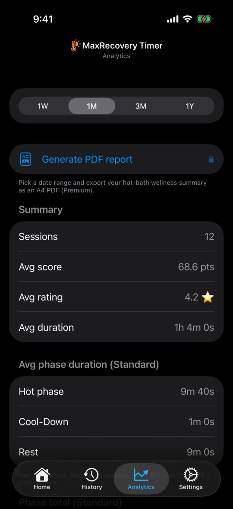

<a href="images/guide/en/report_p1.jpg">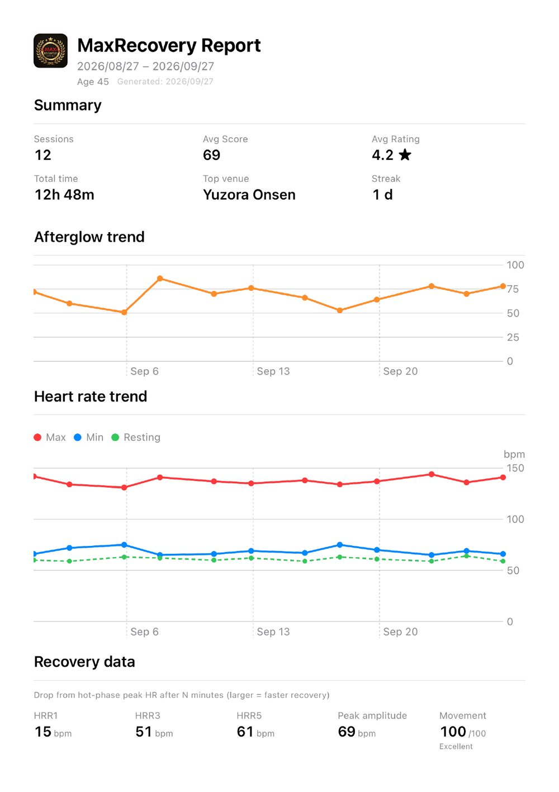</a> <a href="images/guide/en/report_p2.jpg">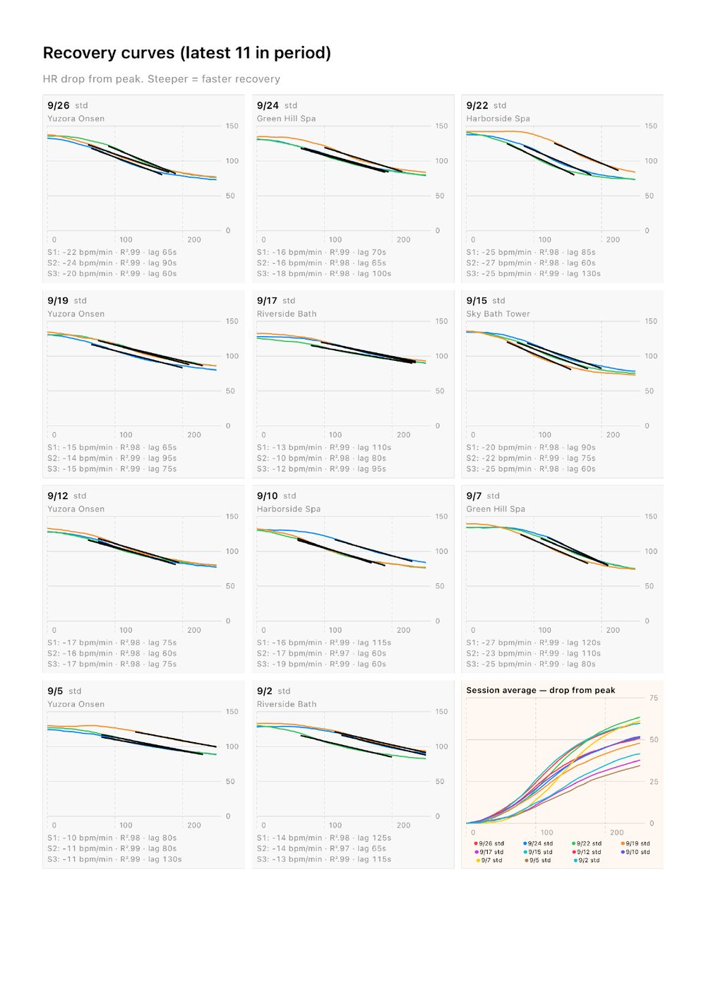</a> <a href="images/guide/en/report_p3.jpg">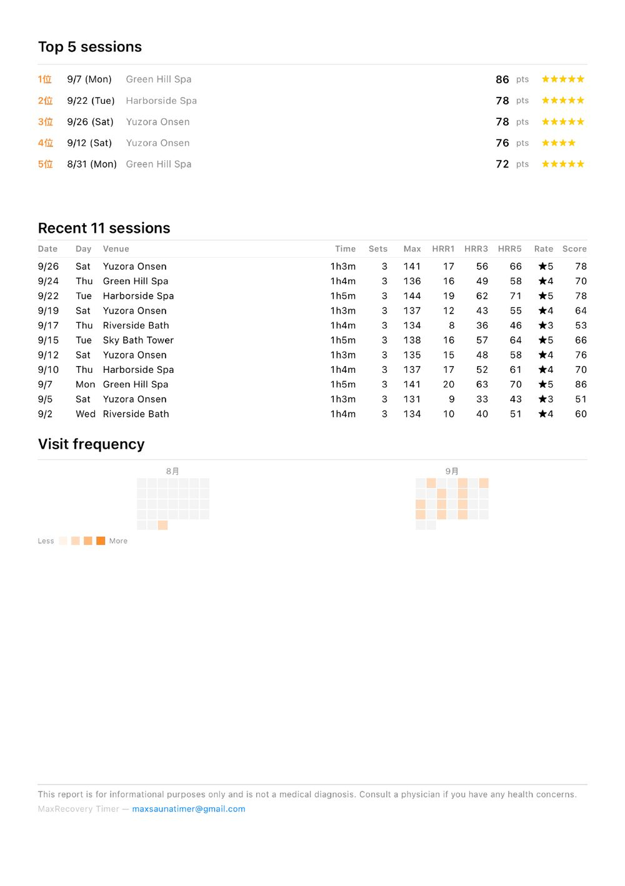</a>

Sample PDF report (fictional data, all 3 pages). Tap to enlarge

### 7. Tips

- Wear the Watch snugly for steady heart-rate readings.
- Add a venue name to show it on the Venue map and in Top sessions.
- Turn on moving-average lines for the heart-rate chart in Settings tab →
  Display.
- Choosing "Sauna" or "Steam Bath" shows a short note about where to use
  the devices. Follow Apple's guidance for Apple Watch and iPhone.
- To save battery, turn off Always On on your Watch.

### 8. Example — 3 sets at a hot bath facility

Before you go, in the iPhone Settings tab: turn on the pre-session phase,
choose your hot environment, and check that the set count is 3 (Default
sets → Defaults).

1. When you arrive, tap Start Standard (it begins in the pre-session phase).
2. Entering the hot phase: Double Tap → Hot phase.
3. Leaving it: Double Tap → Rest (with Cool-Down: twice, Cool-Down → Rest).
4. Entering the next hot phase: Double Tap → next set. Repeat 3–4 until
   you enter the 3rd hot phase.
5. After the 3rd rest, turn the Crown down twice to end, then confirm the
   rating.

That is 6 Double Taps in total (9 with Cool-Down).

### 9. Plank (optional)

Settings tab → Add-ons → Enable plank exercise adds a Plank tab.

- **Countdown** (1–30 min) — keeps counting bonus time after 0:00.
  Double-tap the bottom button to end.
- **Count-up** — runs until you double-tap to end.
- Start with MaxRecovery on your Watch's screen to record heart rate too;
  the Watch saves it to Health as a Core Training workout.
- Set iPhone Auto-Lock longer than your target so the phone doesn't lock
  mid-plank.

---

## 関連 / See also

- [FAQ / よくある質問](faq.html)
- [Privacy Policy / プライバシーポリシー](privacy-policy.html)
- [Terms of Use / 利用規約](terms-of-use.html)

[← Home](index.html)
