# 簡易取説 — MaxRecovery Timer for Apple Watch & iPhone

**Last updated / 最終更新:** 2026-09-28

> 🌐 言語 / Language: **日本語** / [🇺🇸 English](guide-en.html)

> 🐛 **不具合・改善要望はこちら → [フィードバックフォーム](feedback.html)**

---

### 1. 概要

Apple Watch で **温浴 → 休憩** のフェーズと心拍を計測し、iPhone で心拍の回復（HRR）を振り返るアプリです。

- 計測は **Apple Watch** で行います（iPhone 単体では計測できません）。
- **ととのい度スコア（0〜100）** は、温浴後に心拍がどれだけ下がったかから出す参考値です。医療指標ではありません。

---

### 2. セットアップ

- App Store から [MaxRecovery Timer](https://apps.apple.com/jp/app/maxrecovery-timer/id6815294404) をインストール。Watch アプリも自動で入ります（入らないときは iPhone の「Watch」アプリから）。
- 初回起動時に **ヘルスケア** と **位置情報**（任意）を許可。Watch では「同意して続ける」をタップ。
- iCloud にサインインしていれば、履歴は自動でバックアップされます（設定は不要）。
- 温浴環境は iPhone の **設定タブ → 温浴設定 →「温浴環境」** で選びます（採暖室・温泉・お風呂・ホットヨガ・赤外線サウナ・蒸し風呂・サウナ・その他。初期値は採暖室）。

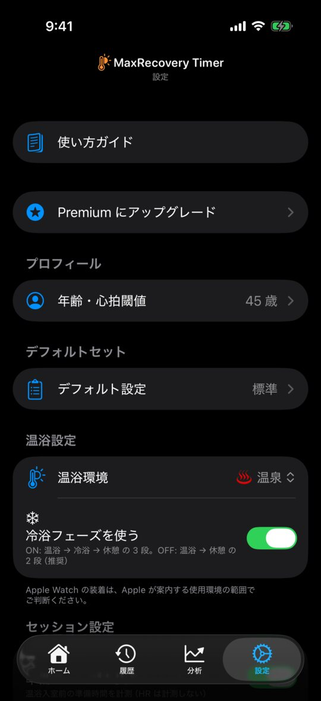

---

### 3. セッションを開始

Apple Watch で MaxRecovery を開き、**「標準モード開始」** か **「シンプルモード開始」** をタップ。

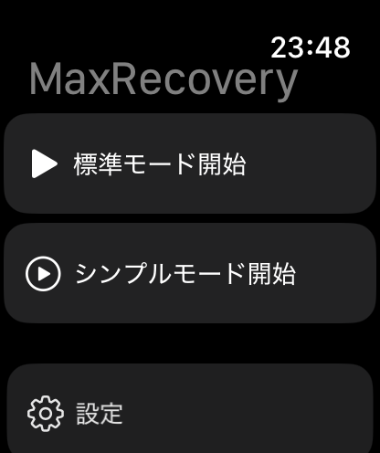

- **標準モード** — 1 セット = 温浴 → 休憩。iPhone の設定タブで次を追加できます。
  - 冷浴: 温浴設定 →「冷浴フェーズを使う」（温浴 → 冷浴 → 休憩）
  - 準備: セッション設定 →「準備フェーズを使う」（最初に 1 回だけ。心拍は計測しません）
  - その他: セッション設定 →「その他フェーズを使う」（各セットの休憩の後）
- **シンプルモード** — フェーズに分けずに計測。ダブルタップで次のセットへ。

---

### 4. セッション中の操作

| 操作 | 動作 |
|---|---|
| ダブルタップ | 次のフェーズへ（シンプルモードは次のセットへ） |
| Digital Crown を上に回す | 一時停止 / 再開 |
| Digital Crown を下に回す | 終了の確認。もう一度下に回すと終了 |
| 画面タップ（設定で ON） | ダブルタップと同じ |

- ダブルタップは、Watch を着けている手の親指と人差し指を 2 回合わせます（Series 9 / Ultra 2 以降などの対応機種）。
- 画面タップで進めるには、iPhone の設定タブ → セッション設定 →「画面タップでフェーズ進行」を ON（初期値はオフ）。ダブルタップ非対応の機種でも使えます。
- 一時停止中はダブルタップ・画面タップでは進みません。
- フェーズは自動では切り替わりません。温浴中は、心拍が閾値1・閾値2に達すると振動します。

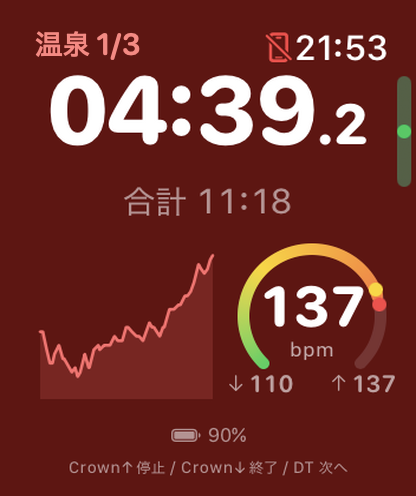 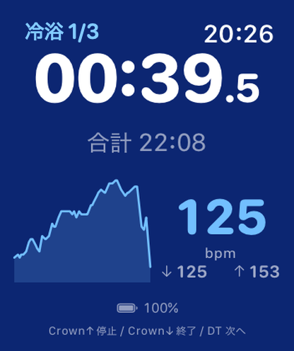 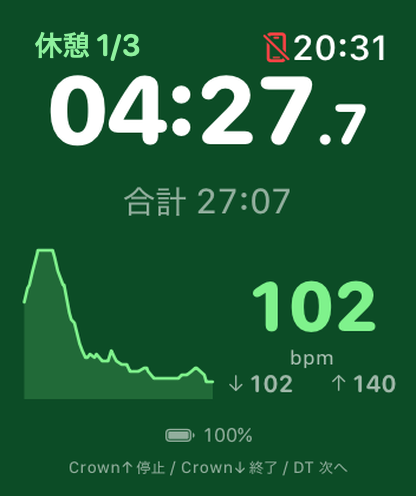

左から 温浴・冷浴・休憩。ゲージの黄と赤の点が閾値1・閾値2

---

### 5. セッションを終える

- **Digital Crown を下に 2 回** 回すと終了します。
- 標準モードでは、最後のセットの休憩でダブルタップすると「どうしますか？」が出ます。「終了」か「もう 1 セット」を **タップ** して選びます。
- 終了後、星（1〜5）を Crown で選んで「確定」をタップ（ダブルタップでも確定）、または「スキップ」をタップ。**ここで初めて保存され、iPhone に送られます。**
- 60 分操作がないと自動で終了します。その後も評価画面で待っているので、MaxRecovery を開いて確定かスキップをしてください。

---

### 6. iPhone で振り返り

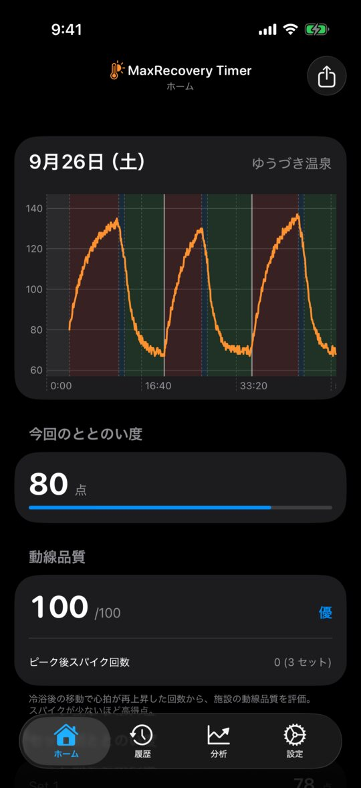 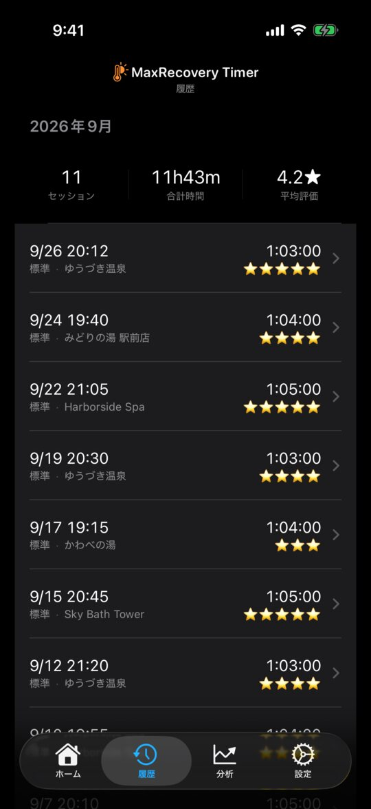

- **履歴** — タップすると心拍チャート・ととのい度・セット別の内訳。施設名や評価もここで編集できます。
- **分析** — トレンド・カレンダー・連続記録・ベストセッション・温浴マップ（位置情報があるセッションのみ）。
- **PDF レポート**（Premium）— 分析タブ →「PDF レポートを生成」→ 期間を選んで「生成して共有」。A4 で 3 ページです。
- **CSV**（Premium）— 設定タブ → データ →「データエクスポート / インポート」。

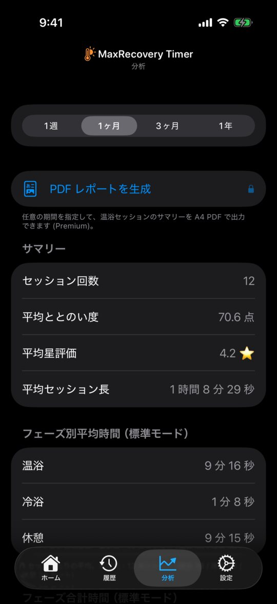

<a href="images/guide/ja/report_p1.jpg">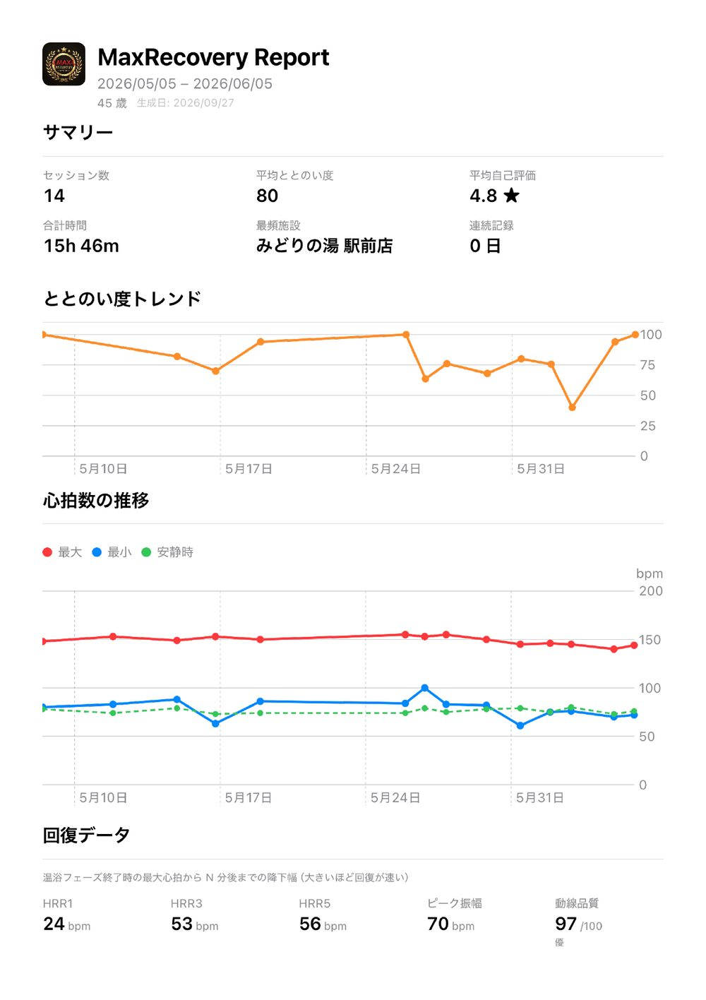</a> <a href="images/guide/ja/report_p2.jpg">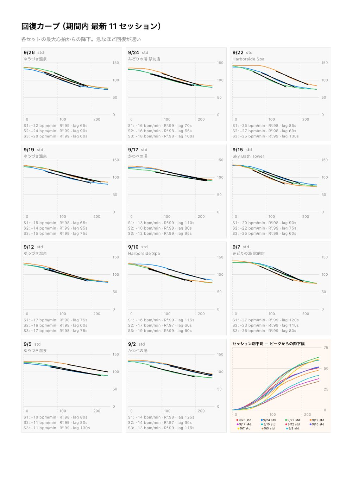</a> <a href="images/guide/ja/report_p3.jpg">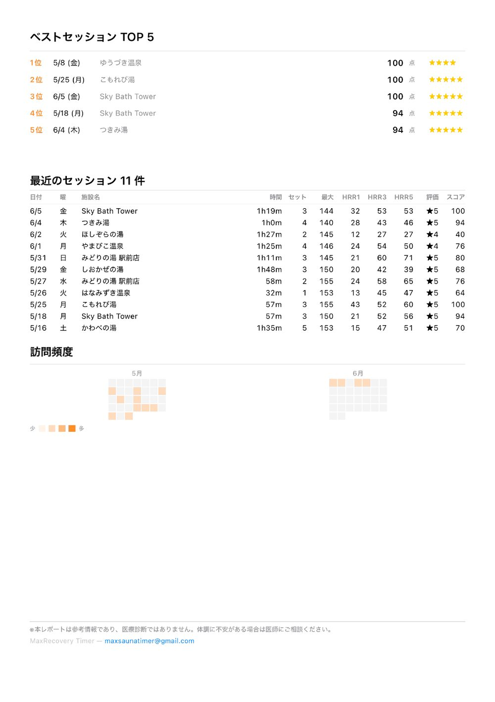</a>

PDF レポートの見本（店名は架空、全 3 ページ）。タップで拡大

---

### 7. コツ

- Apple Watch は手首にしっかり着けると、心拍が安定して取れます。
- 施設名を入れると、温浴マップとベストセッションに表示されます。
- 心拍グラフの移動平均線などは、設定タブ → 表示 で ON にできます。
- 「サウナ」「蒸し風呂」を選ぶと、使用環境の注記が出ます。Apple Watch と iPhone の使用は、Apple が案内する範囲でご判断ください。
- バッテリーを節約したいときは、Watch の「常にオン」をオフにしてください。

---

### 8. 使用例 — 温浴施設で 3 セット

事前に iPhone の設定タブで、準備フェーズを ON、温浴環境を選択、セット数が 3 か確認（デフォルトセット →「デフォルト設定」）。

1. 入館したら「標準モード開始」（準備フェーズから始まります）。
2. 温浴に入るときにダブルタップ → 温浴。
3. 温浴を出たらダブルタップ → 休憩（冷浴ありは 冷浴 → 休憩 で 2 回）。
4. 次の温浴に入るときにダブルタップ → 次のセットの温浴。3 セット目の温浴に入るまで 3〜4 を繰り返す。
5. 3 セット目の休憩が終わったら Crown を下に 2 回で終了し、評価を確定。

ダブルタップは合計 6 回（冷浴ありは 9 回）です。

---

### 9. プランク運動（任意）

設定タブ → 追加機能 →「プランク運動を有効化」で「プランク」タブが出ます。

- **カウントダウン**（1〜30 分）— 0:00 の後もボーナス時間を計測。下のボタンをダブルタップで終了。
- **カウントアップ** — ダブルタップで終了するまで計測。
- Watch の画面に MaxRecovery を出して始めると心拍も記録され、ヘルスケアに「コアトレーニング」として保存されます。

---

## 関連 / See also

- [FAQ / よくある質問](faq.html)
- [Privacy Policy / プライバシーポリシー](privacy-policy.html)
- [Terms of Use / 利用規約](terms-of-use.html)

[← Home / トップ](index.html)
