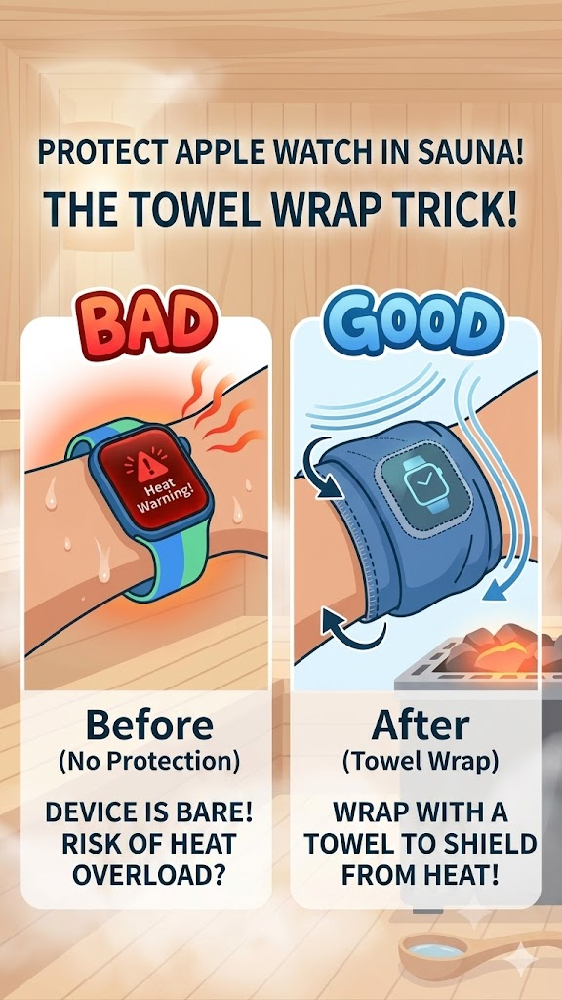
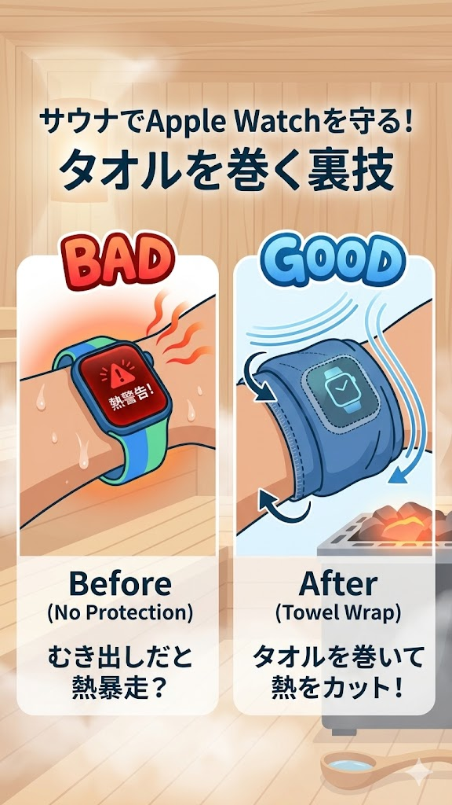

# Quick Guide / 簡易取説 — MaxSauna Timer for Apple Watch & iPhone

**Last updated / 最終更新:** 2026-06-11

> 🐛 **不具合・改善要望はこちら → [フィードバックフォーム](feedback.html)** / Report bugs & suggestions: **[Feedback form](feedback.html)**

---

## English

### 1. Setup

- Install **MaxSauna Timer** from the App Store on your iPhone. The Apple Watch
  companion app installs automatically when your Watch is paired.
- On first launch, grant **Health**, **Notifications**, and (optional) **Location**
  permissions when prompted.
- Optional: enable **iCloud sync** so sessions back up automatically. Settings →
  Apple Watch / Data.

### 2. Start a session

1. Open MaxSauna on your **Apple Watch**.
2. Choose **Standard** or **Simple** mode (set in iPhone Settings → Session).
3. Tap **Start**.

### 3. During the session — hands-free

Once started, you don't need to touch the screen. You can advance phases and
end the session using any of these:

- **Apple Watch Double Tap** (Series 9 / Ultra 2 or newer) — pinch your thumb
  and index finger. This is the recommended hands-free gesture.
- **Digital Crown rotation** — rotate either direction to advance.
- **Screen tap** — only if you enable it under Settings → Session →
  "Screen tap to advance phase" (off by default).

The Watch displays the current phase, elapsed time, heart rate, and your
recent HR peak / bottom (last 5 minutes). Configured phase times act as
**haptic alerts** — the app does not auto-advance.

### 4. End the session

- Use the action above to move past the final phase, or
- The app **auto-ends after 60 minutes** with no input.
- The session is transferred to your iPhone automatically. With iCloud sync,
  it also propagates to your other devices.

### 5. Review on iPhone

- **History tab** — list of sessions. Tap a session to see its heart-rate
  chart, Afterglow Score, set-level breakdown, and (Premium) recovery curves.
- **Analytics tab** — trends, calendar heatmap, streaks, **Best Sessions**
  ranking, and the **Sauna Map** of venues you've visited.
- **Settings → Data → Export CSV** (Premium) for offline backup or analysis.

### 6. Tips

- Wear your Watch snugly for stable heart-rate readings.
- Fill in the **venue** in each session's detail to populate the Sauna Map.
- Add a **1–5 star rating** to power the rating-vs-score correlation chart.
- A 60-minute session uses ~10–15 % of the Watch battery (Series 7 +). Turn off
  Always-On Display if you need extra headroom.
- **Optional chart overlays** — Settings → Display lets you add a 60-second
  and/or 10-minute moving-average line to the HR chart, and hide the
  preparation phase to re-baseline X axis to sauna entry. All default OFF.
- **Protect Apple Watch from sauna heat** — direct sauna heat can trigger
  sensor temperature warnings. Wrap the Watch with a small towel as a heat
  shield; heart-rate measurement continues fine through the fabric.

  

- The Afterglow Score is a **reference value**, not a medical metric.

### 7. Typical workflow — time-limited sauna venues

A recommended flow for time-limited sauna venues (e.g. 60–90 min facilities)
doing **3 sets of sauna → cold plunge → cool-down**.

**Setup before you arrive**:
- Use **Standard mode** (iPhone Settings → Session).
- Enable **"Use Pre-sauna phase"** in Settings → Session.

**At the venue**:
1. When the venue starts your timer (entry tag / locker), tap **Standard** on
   the Watch to start the session. The session enters the **Preparation**
   phase — use this time for changing clothes and body wash.
2. Just before entering the sauna for the **1st time**, **double-tap** the
   Watch → advances to the **Sauna** phase.
3. When entering the **cold water** (cold plunge, lake, pool), double-tap →
   advances to **Cold plunge**.
4. When sitting / lying on the chair or beach chair, double-tap → advances to
   **Cool down**.
5. When entering the sauna for the **next set**, double-tap again → starts
   set 2's Sauna.
6. Repeat 2–5 until the 3rd cool-down ends, then **scroll the Digital Crown
   down twice** to end the session.

Total double-taps per 3-set session: **~9** (3 sauna + 3 plunge + 3 cool-down).
The first double-tap (preparation → sauna) counts in this total.

### 8. Plank exercise (optional add-on)

A built-in plank timer is available as an opt-in. Turn it on in
**Settings → Add-ons → "Enable plank exercise"**. A new "Plank" tab appears
between Analytics and Settings.

- **Countdown mode** — pick a target between **1 and 30 minutes** in 1-minute
  steps. After a **3-2-1 pre-countdown**, the timer runs down to 0:00. When
  the target is reached a strong haptic fires and the display switches to
  **bonus time** (count-up); keep going as long as you can, then double-tap
  the bottom button to end.
- **Count-up mode** — starts at 0:00 and runs until you double-tap the bottom
  button. Used to measure how long you can hold a plank.
- **Apple Watch HR** — if MaxSauna is open on your Watch when you start a
  plank, the Watch starts a `Core Training` HKWorkout session and streams
  heart rate to the iPhone for the whole plank. The Watch shows the current
  elapsed/remaining time and HR until you stop on iPhone.
- **Result screen** — calories burned (estimated via METs), current streak
  days, personal best seconds, total seconds, total days, and max HR.
- **Trend chart** — 1 day = 1 bar (cumulative duration). Color-coded by
  result: green = target reached, orange = under target, blue = count-up
  only. A period picker (1 week / 1 month / 3 months / All) lets you focus.
- **History** — swipe a row left to delete (same as sauna history).
- **Apple Health** — each plank is written as a `Core Training` workout you
  can review in the Health app.

Sessions sync via iCloud so your plank history follows you across devices.

---

## 日本語

### 1. セットアップ

- iPhone の App Store から **MaxSauna Timer** をインストール。Apple Watch をペア
  リング済みなら、Watch コンパニオンアプリは自動でインストールされます。
- 初回起動時に **ヘルスケア**・**通知**・（任意）**位置情報** の権限を許可してく
  ださい。
- 推奨: **iCloud 同期**を有効化（設定 → Apple Watch / データ）。セッションが自動
  でバックアップされます。

### 2. セッションを開始

1. Apple Watch で **MaxSauna** を開く。
2. **標準モード** / **シンプルモード** を選ぶ（iPhone 設定 → セッション）。
3. **開始** をタップ。

### 3. セッション中 — ハンズフリー操作

一度開始すれば、画面に触れずに操作できます。次のいずれかでフェーズ進行 / 終了
を行います:

- **Apple Watch ダブルタップ**（Series 9 / Ultra 2 以降）— 親指と人差し指を 2 回
  軽くつまむ。最も推奨のハンズフリー操作です。
- **Digital Crown 回転** — どちら向きでも次へ進みます。
- **画面タップ** — 任意設定（設定 → セッション → 「画面タップでフェーズ進行」、
  デフォルトはオフ）。

Watch には現在のフェーズ・経過時間・心拍数・直近 5 分の心拍ピーク / ボトムが表
示されます。設定した各フェーズの時間は **ハプティック通知のタイミング**で、
**自動進行はしません**（自分のタイミングで進めるため）。

### 4. セッションを終える

- 最後のフェーズで上記の操作をして終了するか、
- **60 分操作がないと自動終了**します。
- セッションは自動で iPhone に転送されます。iCloud 同期が有効なら、他のデバイス
  にも自動で反映されます。

### 5. iPhone で振り返り

- **履歴タブ** — セッション一覧。タップすると心拍チャート・ととのい度スコア・
  セット別の内訳・（Premium）回復カーブが見られます。
- **分析タブ** — トレンド、カレンダーヒートマップ、連続記録、**ベストセッショ
  ン**ランキング、訪れたサウナを一覧できる **サウナマップ**。
- **設定 → データ → CSV エクスポート**（Premium）— ローカルバックアップや自前
  解析に。

### 6. ちょっとしたコツ

- 心拍を安定して取るため、Apple Watch は手首に **しっかり装着** してください。
- 各セッションの詳細から **施設名** を入れると、サウナマップに反映されます。
- **1〜5 星の評価** をつけると、主観評価 × スコアの相関グラフが充実します。
- 60 分セッションで Apple Watch（Series 7 以降）のバッテリーを 10〜15% 消費しま
  す。さらに節約したい場合は「常時表示」をオフにしてください。
- **任意のチャート表示オプション** — 設定 → 表示 で、心拍グラフに 60 秒移動平均
  線・10 分移動平均線を重ねたり、準備フェーズを除外して X 軸をサウナ入室時を
  0:00 として再表示できます。すべてデフォルト OFF。
- **サウナ熱から Apple Watch を守る** — サウナの直接熱でセンサー温度警告が出る
  ことがあるので、タオルで Watch をすっぽり覆うのが効果的。心拍計測は布越しで
  も問題なく続きます。

  

- ととのい度スコアは **参考値** であり、医療指標ではありません。

### 7. 典型的な使用例 — 時間制限のあるサウナ施設

時間制限のあるサウナ施設（60〜90 分など）で **3 セット（サウナ → 水風呂 →
外気浴 を 3 回繰り返す）** を行う場合の推奨ワークフロー。

**事前設定**:
- **スタンダードモード** を使用（iPhone の設定 → セッション）。
- 設定 → セッションで **「準備フェーズを使う」を ON**。

**施設での操作**:
1. 施設の時間カウントが始まったタイミング（入店タグ・ロッカー）で Watch の
   **「スタンダード」をタップしてセッション開始**。準備フェーズに入る（着替
   え・体を洗う時間に活用）。
2. **1 回目のサウナに入る直前** に Watch を **ダブルタップ** →
   「**サウナ**」フェーズに進む。
3. **水風呂（水風呂・湖・プールなど）に入る** タイミングでダブルタップ →
   「**水風呂**」フェーズに進む。
4. **椅子やビーチチェアで横になる** タイミングでダブルタップ →
   「**外気浴**」フェーズに進む。
5. **次のサウナに入る** タイミングで再度ダブルタップ → 次のセットの
   「サウナ」フェーズへ。
6. 3 セット目の外気浴が終わるまで 2〜5 を繰り返し、最後に
   **Digital Crown を下に 2 回回して** セッションを終了。

3 セットでのダブルタップ合計：**約 9 回**（サウナ 3 + 水風呂 3 + 外気浴 3）。
最初の「準備 → サウナ」のダブルタップもこの合計に含まれます。

### 8. プランク運動（任意の追加機能）

体幹トレ用のプランクタイマーを内蔵しています。**設定 → 追加機能 →
「プランク運動を有効化」** で ON にすると、タブバーの「分析」と「設定」の
間に「プランク」タブが追加されます。

- **カウントダウンモード** — 目標時間を **1〜30 分の 1 分刻み**で選択。
  **3-2-1 のプリカウントダウン**後に計測開始。目標 0:00 に到達すると強い
  haptic で達成通知 → 表示が **追加時間（ボーナス）** のカウントアップに
  切り替わり、限界まで続けたら下部のボタンを **ダブルタップで終了**。
- **カウントアップモード** — 0:00 から開始し、ダブルタップで終了するまで
  何分でも計測。限界耐久時間の記録に。
- **Apple Watch の心拍計測** — プランク開始時に Watch で MaxSauna を起動
  していれば、Watch が `Core Training` の HKWorkout セッションを開始し、
  心拍を iPhone へリアルタイム送信。Watch 側には経過 / 残り時間と心拍数が
  表示されます。終了は iPhone 側で操作。
- **結果画面** — 消費カロリー（MET 法で推定）、連続日数、過去最高秒数、
  累計秒数、累計日数、最大心拍を表示。
- **推移グラフ** — 1 日 1 本の累積棒グラフ。色分けは緑=目標達成 /
  オレンジ=未達 / 青=カウントアップのみ。期間ピッカー（1 週間 / 1 ヶ月
  / 3 ヶ月 / 全期間）で表示範囲を絞れます。
- **履歴** — 行を左にスワイプで削除（サウナ履歴と同じ操作）。
- **Apple ヘルスケア連携** — 各プランクは `Core Training` ワークアウト
  としてヘルスケアアプリに記録されます。

セッションは iCloud 同期されるので、端末を変えてもプランク履歴は引き
継がれます。

---

## 関連 / See also

- [FAQ / よくある質問](faq.html)
- [Privacy Policy / プライバシーポリシー](privacy-policy.html)
- [Terms of Use / 利用規約](terms-of-use.html)
