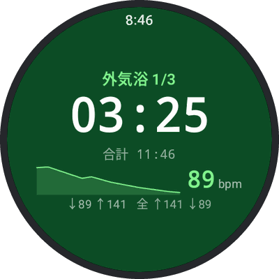
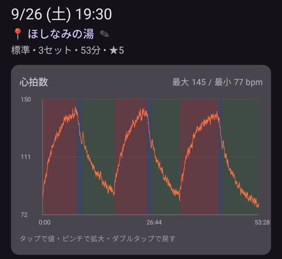
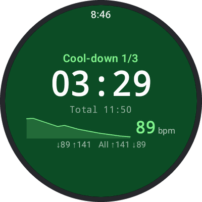
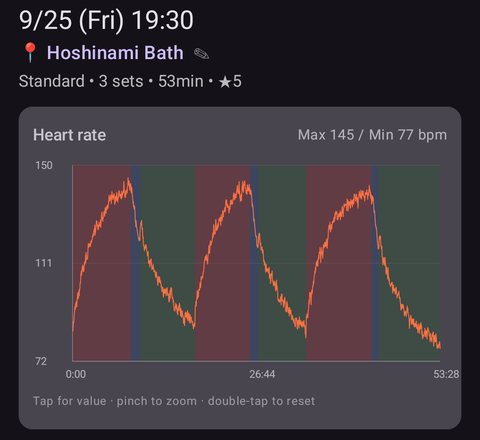


作業メモ（Liquid のコメントなので、公開ページには出ない）
- Google グループの設定は確認済み（2026-09-27：メンバーの一覧はオーナーのみ・メールアドレスは管理者のみ）。設定を変えたら、手順 1 の「管理者には見える」も見直す。
- 公開する日に「最終更新 / Last updated」の日付を合わせる（2026-09-27 の公開で合わせた。以後は中身を変えたら更新）。
- このページにメールアドレスは載せない（問い合わせはフィードバックフォームのみ）。
- Play の掲載名は 2026-09-27 に MaxRecovery Timer へ変更（公開済み）。1.0.0 候補（アプリの名前も MaxRecovery）の配信で、日本語・English の「参加の手順 / How to join」の 3 にあった「入れたアプリは旧名で表示」の注記は消した（9/27）。
- Premium の注記: 1.0.0 候補（Premium を開放したテスト用ビルド）の配信後に、日本語・English の「ご注意 / Please note」の Premium の行を「テスト版では Premium の機能をすべて無料で使えます（購入は不要です。製品版では購入が必要です）」/「In the test version, all Premium features are free to use (no purchase needed; the released version will require a purchase).」に差し替え済み（9/27）。無料で使えるのはビルドから 90 日（1.0.0 候補は 2026-12-26 まで）で、過ぎたテスト用ビルドで購入すると請求されるので、期限の前に次のテスト用ビルドを配るか、この行を見直す。製品版の公開時（R6）に、この行を消す（募集を続けるなら「製品版では購入が必要です」だけにする）。
- 画面の画像: assets/img/beta/（store_assets/screenshots の ja-JP・en-US の 1.0.0 候補の撮り直しから。*-watch-cooldown.png は wear/02_cool_down を 380px に縮めて灰色の縁つきの丸に切り抜いたもの。*-phone-chart.jpg は phone/01_home_heart_rate の上側（1080 幅の y=55〜1045）を切り出したもの、押すと *-phone-heart-rate.jpg の全画面が開く）。ウォッチの画像は 1.0.0 候補の新しい計測画面（0.1.7 とは見た目が違ったが、9/27 の 1.0.0 候補の配信で配信中の版とそろった。解消）


# テスター募集 / Join the beta

[日本語](#ja) ・ [English](#en) 最終更新 / Last updated: 2026-09-27

---

## 日本語 {#ja}

**MaxRecovery Timer の Android 版のテスターを募集しています。**サウナ→水風呂→外気浴の心拍を、ウォッチで記録してスマホで振り返るアプリです。

  <figure class="watch"><figcaption>ウォッチで記録</figcaption></figure>
  <figure class="phone"><figcaption>心拍のグラフ</figcaption></figure>

### どんなアプリ？

- 心拍が落ち着く速さを「ととのい度」で表します（参考値）。
- 対応：Pixel Watch などの Wear OS ウォッチ、Android スマホ

iPhone / Apple Watch 版（温浴の記録アプリ）は App Store で配信中です：[日本語](https://apps.apple.com/jp/app/maxrecovery-timer/id6815294404) ・ [English](https://apps.apple.com/us/app/maxrecovery-timer/id6815294404)
{: .beta-store}

### お願い（2 つ）

1. **14 日間、参加を続けてください。**製品版の公開に必要です。
2. **気づいたことを [フィードバックフォーム](../feedback.html) で送ってください。**「ご利用のソフトウェア」は「Android版アプリ」を選びます。

### 参加の条件

- Android 11 以降のスマホ
- Google Play の国／地域が日本の Google アカウント
- Wear OS 3 以降のウォッチ（任意。記録にはウォッチが必要）

### 参加の手順

1. [Google グループ](https://groups.google.com/g/maxrecovery-testers) で「グループに参加」を押す（スマホの Google Play と同じアカウントで。管理者の開発者には、メールアドレスが見えます）
2. [参加用リンク](https://play.google.com/apps/testing/com.anraku.maxsaunatimer) を開き、「テスターになる」を押す
3. 同じページにある Google Play へのリンクから、スマホに入れる
4. ウォッチがあれば、スマホの Play ストアでインストール先にウォッチも選ぶ（同じ Google アカウントで）

「テスターになる」が出ないときは、ブラウザの Google アカウントがグループに入ったものと同じか確かめ、少し待ってから開き直してください。

### ご注意

- テスト版なので、不具合が起きることがあります。
- **テスト版では Premium の機能をすべて無料で使えます**（購入は不要です。製品版では購入が必要です）。
- 医療機器ではありません。表示は参考情報です。

データの扱い・やめ方など

- データの扱い：[プライバシーポリシー](privacy-policy.html)
- やめるとき：[参加用ページ](https://play.google.com/apps/testing/com.anraku.maxsaunatimer) で「プログラムを終了」
- ウォッチは、メーカーが案内する使用環境の範囲でお使いください。

### お問い合わせ

ご質問も [フィードバックフォーム](../feedback.html) からどうぞ。お知らせは X（[@anraku_tech](https://x.com/anraku_tech)）に投稿します。

---

## English {#en}

**We are looking for testers for the Android version of MaxRecovery Timer.** It records your heart rate through sauna, cold bath and cool-down on your watch, and you review it on your phone.

  <figure class="watch"><figcaption>Record on the watch</figcaption></figure>
  <figure class="phone"><figcaption>Heart-rate chart</figcaption></figure>

### About the app

- Shows how quickly your heart rate settles as an Afterglow Score (for reference).
- Works with Wear OS watches such as Pixel Watch, and Android phones.

The iPhone / Apple Watch version (a hot-bath tracker) is on the App Store: [Japanese](https://apps.apple.com/jp/app/maxrecovery-timer/id6815294404) ・ [English](https://apps.apple.com/us/app/maxrecovery-timer/id6815294404)
{: .beta-store}

### Two requests

1. **Stay in the test for 14 days.** We need this to release the app on Google Play.
2. **Send what you notice through the [feedback form](../feedback.html).** The form is in Japanese: under "ご利用のソフトウェア" (software), choose "Android版アプリ".

### Requirements

- An Android phone (Android 11 or later)
- A Google account whose Google Play country is Japan
- A Wear OS 3+ watch (optional, but you need one to record sessions)

### How to join

1. Open the [Google Group](https://groups.google.com/g/maxrecovery-testers) and tap "Join group" (same account as Google Play on your phone; the developer, as group manager, can see your email address)
2. Open the [opt-in link](https://play.google.com/apps/testing/com.anraku.maxsaunatimer) and tap "Become a tester"
3. Use the Google Play link on that page to install the app on your phone
4. If you have a watch, choose it as an install device in the Play Store on your phone (same Google account)

If "Become a tester" does not appear, check that your browser is signed in with the account that joined the group, wait a little and open the link again.

### Please note

- This is a test version, so there may be bugs.
- **In the test version, all Premium features are free to use** (no purchase needed; the released version will require a purchase).
- Not a medical device. All values are for reference only.

Data, leaving the test, etc.

- Your data: see the [Privacy Policy](privacy-policy.html).
- To leave: tap "Leave the program" on the [opt-in page](https://play.google.com/apps/testing/com.anraku.maxsaunatimer).
- Use your watch as its manufacturer advises.

### Contact

Questions are welcome through the [feedback form](../feedback.html). To get a reply, fill in "メールアドレス" (email address) on the form. News is posted on X: [@anraku_tech](https://x.com/anraku_tech).

