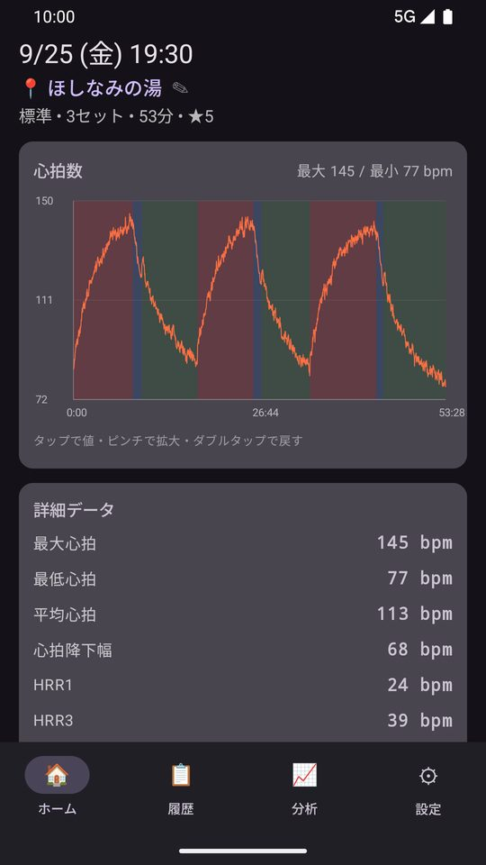
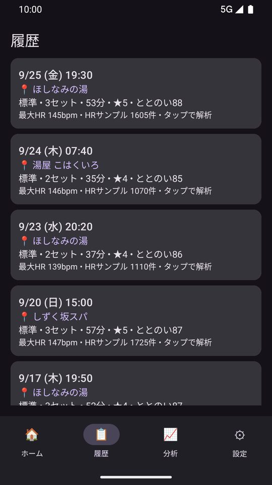
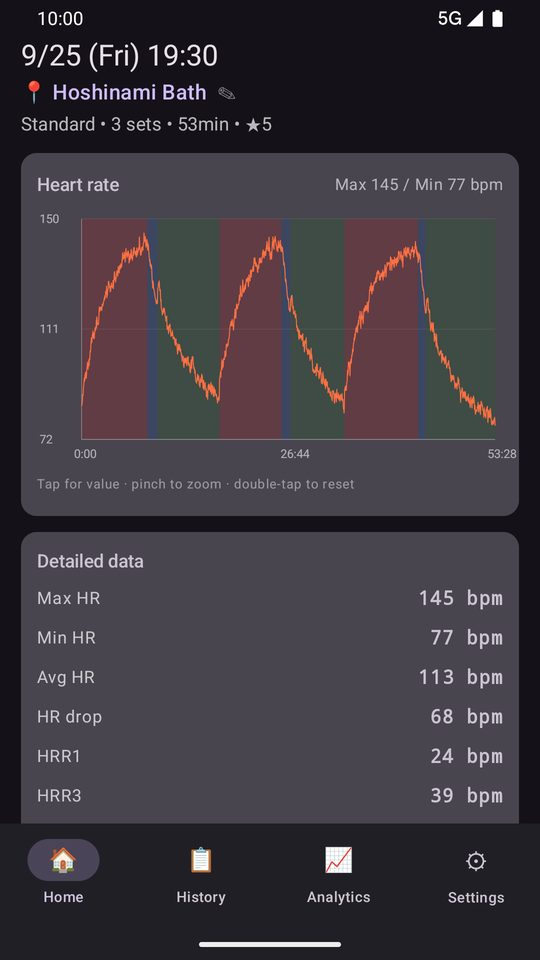
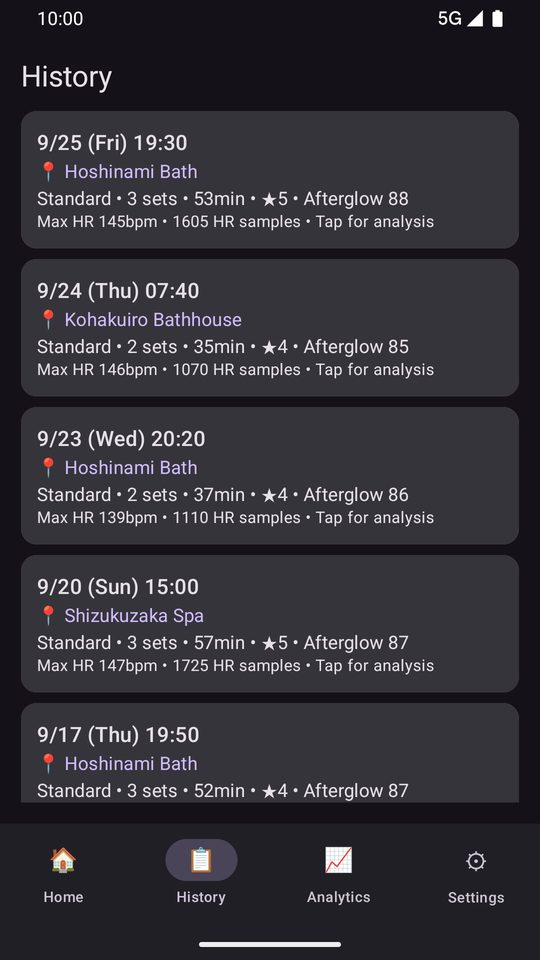

<!--
公開前に差し替えるもの / Replace before publishing:
- 公開前に確認: グループを「Alpha」と Wear OS 専用トラック「Wear Alpha」の両方のテスターに登録したか。
  （参加用リンクは Alpha と Wear Alpha で同じ https://play.google.com/apps/testing/com.anraku.maxsaunatimer 。2026-09-26 に Play Console で確認）
  両トラックのテスターを「メーリング リスト」から「Google グループ」に切り替えたか（今の 2 人が先にグループに入っていること）。
  グループの「メンバー一覧を表示できるユーザー」を管理者のみにしたか（参加者どうしでメールアドレスが見えないように）。
- このページにメールアドレスは載せない（問い合わせはフィードバックフォームのみ）。
- 差し替えたら、このコメントごと削除する。

Play の掲載名が MaxRecovery Timer に変わったら更新するもの / Update when the Play listing is renamed:
- 「旧名「MaxSauna Timer」」と書いている行（日本語・English の「参加の手順 / How to join」の 3）。

画面の画像 / Screenshots: assets/img/beta/（store_assets/screenshots の ja-JP・en-US から縮小）
-->

# テスター募集 / Join the beta — MaxRecovery Timer for Pixel Watch & Android

[日本語](#ja) ・ [English](#en) ・ 最終更新 / Last updated: 2026-09-27

---

## 日本語 {#ja}

**MaxRecovery Timer の Android 版のテスターを募集しています。**
Google Play のクローズドテストで、感想を聞かせてください。

  <figure class="watch"><figcaption>ウォッチで記録</figcaption></figure>
  <figure class="phone"><figcaption>心拍のグラフ</figcaption></figure>
  <figure class="phone"><figcaption>ととのい度の履歴</figcaption></figure>

### どんなアプリ？

- サウナ→水風呂→外気浴のセットごとに、心拍を記録します。
- 心拍が落ち着く速さを「ととのい度」で表します（参考値）。
- Pixel Watch などの Wear OS ウォッチで記録し、Android スマホで振り返ります。

iPhone / Apple Watch 版（温浴の記録アプリ）は App Store で配信中です：[日本語](https://apps.apple.com/jp/app/maxrecovery-timer/id6815294404) ・ [English](https://apps.apple.com/us/app/maxrecovery-timer/id6815294404)
{: .beta-store}

### お願い（2 つ）

1. **14 日間、参加を続けてください。** 製品版の公開に必要です。
2. **気づいたことを [フィードバックフォーム](../feedback.html) で送ってください。** 「ご利用のソフトウェア」は「Android版アプリ」を選びます。

### 参加の条件

- Android 11 以降のスマホ
- Google Play の国が日本の Google アカウント
- Wear OS 3 以降のウォッチ（任意。心拍の計測に必要）

### 参加の手順

1. [Google グループ](https://groups.google.com/g/maxrecovery-testers) に参加する（スマホの Google Play と同じアカウントで）
2. [参加用リンク](https://play.google.com/apps/testing/com.anraku.maxsaunatimer) を開き、「テスターになる」を押す
3. Google Play からスマホにインストールする（今は旧名「MaxSauna Timer」と表示）
4. ウォッチがあれば、ウォッチにも入れる（同じ Google アカウントで）

うまくいかないとき

- ページが出ないときは、少し待って開き直してください。
- ウォッチへは、スマホの Play ストアでインストール先に選ぶか、ウォッチの Play ストアから入れます。

### ご注意

- テスト版なので、不具合が起きることがあります。
- **Premium の購入は不要です。** テスト版でも、購入すると代金が請求されます。

そのほかの注意（データ・やめ方など）

- グループの管理者（開発者）には、あなたのメールアドレスが見えます。
- データの扱い：[プライバシーポリシー](privacy-policy.html)
- やめるとき：[参加用ページ](https://play.google.com/apps/testing/com.anraku.maxsaunatimer) で「プログラムを終了」
- 医療機器ではありません。表示はすべて参考情報です。
- ウォッチは、メーカーが案内する使用環境の範囲でお使いください。

### お問い合わせ

ご質問も [フィードバックフォーム](../feedback.html) からどうぞ。お知らせは X（[@anraku_tech](https://x.com/anraku_tech)）で。

---

## English {#en}

**We are looking for testers for the Android version of MaxRecovery Timer.**
Join the closed test on Google Play and tell us what you think.

  <figure class="watch"><figcaption>Record on the watch</figcaption></figure>
  <figure class="phone"><figcaption>Heart-rate chart</figcaption></figure>
  <figure class="phone"><figcaption>Score history</figcaption></figure>

### About the app

- Records your heart rate for each round of sauna, cold bath and cool-down.
- Shows how quickly it settles as an Afterglow Score (for reference).
- Record on a Wear OS watch such as Pixel Watch, and review on your Android phone.

The iPhone / Apple Watch version (a hot-bath tracker) is on the App Store: [Japanese](https://apps.apple.com/jp/app/maxrecovery-timer/id6815294404) ・ [English](https://apps.apple.com/us/app/maxrecovery-timer/id6815294404)
{: .beta-store}

### Two requests

1. **Stay in the test for 14 days.** We need this to publish the app.
2. **Send what you notice through the [feedback form](../feedback.html).** Under "ご利用のソフトウェア" (software), choose "Android版アプリ".

### Requirements

- An Android phone (Android 11 or later)
- A Google account whose Google Play country is Japan
- A Wear OS 3+ watch (optional; needed to record heart rate)

### How to join

1. Join the [Google Group](https://groups.google.com/g/maxrecovery-testers) (same account as Google Play on your phone)
2. Open the [opt-in link](https://play.google.com/apps/testing/com.anraku.maxsaunatimer) and tap "Become a tester"
3. Install from Google Play on your phone (listed as "MaxSauna Timer" for now)
4. If you have a watch, install it there too (same Google account)

If something does not show up

- Pages may take a while to appear. Wait and open them again.
- For the watch, pick it as the device in the Play Store on your phone, or use the Play Store on the watch.

### Please note

- This is a test version, so there may be bugs.
- **You do not need to buy Premium.** Purchases in the test version are charged for real.

More notes (data, leaving, etc.)

- The group's manager (the developer) can see your email address.
- Your data: see the [Privacy Policy](privacy-policy.html).
- To leave: tap "Leave the program" on the [opt-in page](https://play.google.com/apps/testing/com.anraku.maxsaunatimer).
- Not a medical device. All values are for reference only.
- Use your watch as its manufacturer advises.

### Contact

Questions are welcome through the [feedback form](../feedback.html). News is on X: [@anraku_tech](https://x.com/anraku_tech).
